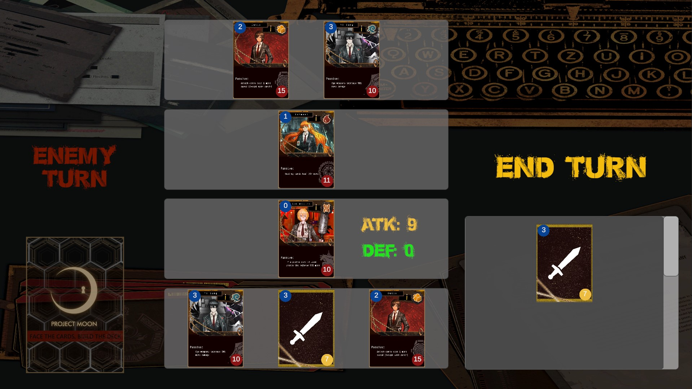

# TC2005B_Videogame
Repository for development of the game project for TC2005B

# **Speed Based TCG (Tentative Limbus Company)**

## _Game Design Document_

---

##### **Copyright notice / author information / boring legal stuff nobody likes**

##
## _Index_

---

1. [Index](#index)
2. [Game Design](#game-design)
    1. [Summary](#summary)
    2. [Gameplay](#gameplay)
    3. [Mindset](#mindset)
3. [Technical](#technical)
    1. [Screens](#screens)
    2. [Controls](#controls)
    3. [Mechanics](#mechanics)
4. [Level Design](#level-design)
    1. [Themes](#themes)
        1. Ambience
        2. Objects
            1. Ambient
            2. Interactive
        3. Challenges
    2. [Game Flow](#game-flow)
5. [Development](#development)
    1. [Abstract Classes](#abstract-classes--components)
    2. [Derived Classes](#derived-classes--component-compositions)
6. [Graphics](#graphics)
    1. [Style Attributes](#style-attributes)
    2. [Graphics Needed](#graphics-needed)
7. [Sounds/Music](#soundsmusic)
    1. [Style Attributes](#style-attributes-1)
    2. [Sounds Needed](#sounds-needed)
    3. [Music Needed](#music-needed)
8. [Schedule](#schedule)

## _Game Design_

---

### **Summary**

A turn based Deckbuilding game where you must choose when and how your cards interact with the opponent's cards one at a time, using strategy to manage each card's speed (energy) which is used with most actions through the cards in your hand.

### **Gameplay**

The game's decks are made of 23 cards. 3 of them are the identity cards, which are the ones in play at all times in the match, and the rest are a mix of attack, defense andmiscellaneous cards (such as draw cards and effect cards). Matches are intended to last around 14 turns, 7 from each player.

### - **Card Types**

**Identity Cards:** The cards that are in the board interacting with each other. Three of these cards can be in a deck. They have two stats, the left top of the card shows the available speed of it, and the bottom right shows its health. They also have a description of their passive ability in the middle of the card.

**Attack Cards:** Attack cards can be played for the front card to do an attack. They also have two stats, damage and speed cost. For now, the damages are 3, 4, and 5 damage costing 1, 2, and 3 speed respectively. The damage of the card, however, can be further increased with effect cards.

**Defense Cards:** Similar to attack cards, there are three defense cards available to add to a deck. They absorb 3, 5, and 10 damage, costing 1, 2, and 3 speed respectively. This absorption can be increased or decreased with effect cards as well.

**Miscellaneous Cards:** Two general types exist:

- Draw cards: Allow you to draw 2 cards from your pile. A maximum of 3 of these cards can be in a deck.
- Effect cards: These cards have caried effects that can apply to identities, attack or defense cards. Some allow you to pierce an opponent's defense card, increase the defense value of a defense card, increase the damage dealt by an attack card, prevent a swap, heal an identity, etc. These cards are used at the beginning of a turn after the swap selection. 

### **Match Gameplay**
- Game Start:
Identity cards are placed on the board.

- Player Turn:
- Player is given the option to swap the front card for one of the two back cards or leave the front card in combat. An effect of swapping cards is regenerating the card's original speed value. If a card that had 3 speed and used 2 goes back to having 3 speed when swapping. This is intended to help avoid defense card spamming.

- If the player swaps the card the card placement changes, if not, it stays the same. The player then draws 2 cards. In this case, an attack and a defense card from the pile.

- The player can use 1 action card (atk, def) per turn and as many item cards as the conditions allow in the card description. In this case, the attack card is played, reducing the front card's speed by 1.

- The card performs the action (attack) and the action card gets discarded. The opposing card loses 3 HP

- Player turn ends, opponent's turn starts. The opponent uses the same gameloop as the player.

**This loop repeats until either the player's or the opponent's cards all reach 0 HP.**

### **Mindset**

What kind of mindset do you want to provoke in the player? Do you want them to feel powerful, or weak? Adventurous, or nervous? Hurried, or calm? How do you intend to provoke those emotions?
The intention is for the player to have to manage their speed while also considering what the opponent could do to their front facing card, attempting to predict posibilities and choosing the best course of action, wether this is defending, attacking or using effect cards to increase their stats.

## _Technical_

---

### **Screens**

1. Title Screen
    1. Options
2. Level Select
3. Game
    1. Inventory
    2. Assessment / Next Level
4. End Credits

_(example)_

### **Controls**

How will the player interact with the game? Will they be able to choose the controls? What kind of in-game events are they going to be able to trigger, and how? (e.g. pressing buttons, opening doors, etc.)

### **Mechanics**

Are there any interesting mechanics? If so, how are you going to accomplish them? Physics, algorithms, etc.

## _Level Design_

---

_(Note : These sections can safely be skipped if they're not relevant, or you'd rather go about it another way. For most games, at least one of them should be useful. But I'll understand if you don't want to use them. It'll only hurt my feelings a little bit.)_

### **Themes**

1. Forest
    1. Mood
        1. Dark, calm, foreboding
    2. Objects
        1. _Ambient_
            1. Fireflies
            2. Beams of moonlight
            3. Tall grass
        2. _Interactive_
            1. Wolves
            2. Goblins
            3. Rocks
2. Castle
    1. Mood
        1. Dangerous, tense, active
    2. Objects
        1. _Ambient_
            1. Rodents
            2. Torches
            3. Suits of armor
        2. _Interactive_
            1. Guards
            2. Giant rats
            3. Chests

_(example)_

### **Game Flow**

1. Player starts in forest
2. Pond to the left, must move right
3. To the right is a hill, player jumps to traverse it ("jump" taught)
4. Player encounters castle - door's shut and locked
5. There's a window within jump height, and a rock on the ground
6. Player picks up rock and throws at glass ("throw" taught)
7. … etc.

_(example)_

## _Development_

---

### **Abstract Classes / Components**

1. BasePhysics
    1. BasePlayer
    2. BaseEnemy
    3. BaseObject
2. BaseObstacle
3. BaseInteractable

_(example)_

### **Derived Classes / Component Compositions**

1. BasePlayer
    1. PlayerMain
    2. PlayerUnlockable
2. BaseEnemy
    1. EnemyWolf
    2. EnemyGoblin
    3. EnemyGuard (may drop key)
    4. EnemyGiantRat
    5. EnemyPrisoner
3. BaseObject
    1. ObjectRock (pick-up-able, throwable)
    2. ObjectChest (pick-up-able, throwable, spits gold coins with key)
    3. ObjectGoldCoin (cha-ching!)
    4. ObjectKey (pick-up-able, throwable)
4. BaseObstacle
    1. ObstacleWindow (destroyed with rock)
    2. ObstacleWall
    3. ObstacleGate (watches to see if certain buttons are pressed)
5. BaseInteractable
    1. InteractableButton

_(example)_

## _Graphics_

---

### **Style Attributes**

What kinds of colors will you be using? Do you have a limited palette to work with? A post-processed HSV map/image? Consistency is key for immersion.

What kind of graphic style are you going for? Cartoony? Pixel-y? Cute? How, specifically? Solid, thick outlines with flat hues? Non-black outlines with limited tints/shades? Emphasize smooth curvatures over sharp angles? Describe a set of general rules depicting your style here.

Well-designed feedback, both good (e.g. leveling up) and bad (e.g. being hit), are great for teaching the player how to play through trial and error, instead of scripting a lengthy tutorial. What kind of visual feedback are you going to use to let the player know they're interacting with something? That they \*can\* interact with something?

### **Graphics Needed**

1. Characters
    1. Human-like
        1. Goblin (idle, walking, throwing)
        2. Guard (idle, walking, stabbing)
        3. Prisoner (walking, running)
    2. Other
        1. Wolf (idle, walking, running)
        2. Giant Rat (idle, scurrying)
2. Blocks
    1. Dirt
    2. Dirt/Grass
    3. Stone Block
    4. Stone Bricks
    5. Tiled Floor
    6. Weathered Stone Block
    7. Weathered Stone Bricks
3. Ambient
    1. Tall Grass
    2. Rodent (idle, scurrying)
    3. Torch
    4. Armored Suit
    5. Chains (matching Weathered Stone Bricks)
    6. Blood stains (matching Weathered Stone Bricks)
4. Other
    1. Chest
    2. Door (matching Stone Bricks)
    3. Gate
    4. Button (matching Weathered Stone Bricks)

_(example)_

## _Sounds/Music_

---

### **Style Attributes**

Again, consistency is key. Define that consistency here. What kind of instruments do you want to use in your music? Any particular tempo, key? Influences, genre? Mood?

Stylistically, what kind of sound effects are you looking for? Do you want to exaggerate actions with lengthy, cartoony sounds (e.g. mario's jump), or use just enough to let the player know something happened (e.g. mega man's landing)? Going for realism? You can use the music style as a bit of a reference too.

 Remember, auditory feedback should stand out from the music and other sound effects so the player hears it well. Volume, panning, and frequency/pitch are all important aspects to consider in both music _and_ sounds - so plan accordingly!

### **Sounds Needed**

1. Effects
    1. Soft Footsteps (dirt floor)
    2. Sharper Footsteps (stone floor)
    3. Soft Landing (low vertical velocity)
    4. Hard Landing (high vertical velocity)
    5. Glass Breaking
    6. Chest Opening
    7. Door Opening
2. Feedback
    1. Relieved "Ahhhh!" (health)
    2. Shocked "Ooomph!" (attacked)
    3. Happy chime (extra life)
    4. Sad chime (died)

_(example)_

### **Music Needed**

1. Slow-paced, nerve-racking "forest" track
2. Exciting "castle" track
3. Creepy, slow "dungeon" track
4. Happy ending credits track
5. Rick Astley's hit #1 single "Never Gonna Give You Up"

_(example)_

## _Schedule_

---

_(define the main activities and the expected dates when they should be finished. This is only a reference, and can change as the project is developed)_

1. develop base classes
    1. base entity
        1. base player
        2. base enemy
        3. base block
  2. base app state
        1. game world
        2. menu world
2. develop player and basic block classes
    1. physics / collisions
3. find some smooth controls/physics
4. develop other derived classes
    1. blocks
        1. moving
        2. falling
        3. breaking
        4. cloud
    2. enemies
        1. soldier
        2. rat
        3. etc.
5. design levels
    1. introduce motion/jumping
    2. introduce throwing
    3. mind the pacing, let the player play between lessons
6. design sounds
7. design music

_(example)_
