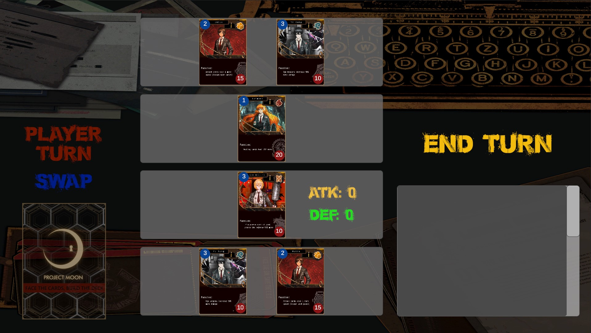

# TC2005B_Videogame
Repository for development of the game project for TC2005B
Developed by Pixel Pioneers

A01784901 - Fabrizio Barrios Blanco

A01784217 - Nicole Dávila Hernández

A01028033 - Miguel Enrique Soria

A01028796 - Fernando Adrián Fuentes Martínez

# **SUBMIL TCG**

## _Game Design Document_

---

##### **Copyright notice / author information / boring legal stuff nobody likes**

##
## _Index_

---

1. [Index](#index)
2. [Game Design](#game-design)
    1. [Summary](#summary)
    2. [Gameplay](#gameplay)
    3. [Mindset](#mindset)
3. [Technical](#technical)
    1. [Screens](#screens)
    2. [Controls](#controls)
    3. [Mechanics](#mechanics)
4. [Level Design](#level-design)
    1. [Themes](#themes)
    2. [Game Flow](#game-flow)
5. [Development](#development)
    1. [Abstract Classes](#abstract-classes--components)
    2. [Derived Classes](#derived-classes--component-compositions)
6. [Graphics](#graphics)
    1. [Style Attributes](#style-attributes)
    2. [Graphics Needed](#graphics-needed)
7. [Sounds/Music](#soundsmusic)
    1. [Style Attributes](#style-attributes-1)
    2. [Sounds Needed](#sounds-needed)
    3. [Music Needed](#music-needed)
8. [Schedule](#schedule)

## _Game Design_

### Elevator Pitch / Concept Statement

Step into the strategic battleground of Submil, where your wit is your greatest weapon. In this turn-based deckbuilding game, you’ll dive into a world where every card and every move is a step in a high-stakes dance of strategy. With a deck of 23 unique cards, including three identity cards that define your playstyle, you’ll engage in cerebral combat that lasts an intense 14 turns.

Each character is not just a scientist, but a rebel with a cause. They’re fighting not just for victory, but for their beliefs, challenging society itself. In Submil, managing your card’s energy is as crucial as the attacks you launch. Every action, from drawing a card to unleashing an effect, is a calculated risk that could lead to triumph or defeat.

Are you ready to challenge the status quo? To outthink and outmaneuver your opponent in a game where intellect is mightier than the sword? Submil isn’t just a game; it’s a revolution one turn at a time. Join the rebellion, craft your strategy, and emerge victorious in the world of Submil.

### Characters

Submil is considered the first and only part of its arc. It is set in a universe where scientific and technological advances have taken a turn for the worst. They ended up in the wrong hands, where only the elites of society have the possibility of acquiring and benefiting from them.

This is how *The Crisis Unit* was born; a group of the most powerful minds whose goal is to decentralize the domain of power that the authorities have taken control over.

*The Crisis Unit* is made up of Faust, Don Quixote, Heathcliff, Gregor, Ismael and Outis; Each of them has unique passive abilities, which will help the player defeat their opponent.

The player, in this case, could be considered a new member of this unit, who has been personally recruited by this group.

### Setting

Similar to the setting of the universe of the *Arcane* series based off of *League of Legends*, the place where the events of this world take place and where the player's games will take place is somewhat murky.

The city, Vreumcaster, where they are located, is in ruins. The population takes drastic measures to survive, while the aristocrats enjoy all the luxuries that are only imaginable for those below.

However, *The Crisis Unit*, despite living in the ruins of Vreumcaster, being pursued by the government, must hide among the rubble to develop their plans and artifacts that they will use to defeat those who have declared themselves their enemies. They work inside a laboratory, camouflaged under a bridge to go unnoticed. They sometimes find it necessary to change their hiding place, although they have never been captured.

### **Summary**

A turn based Deckbuilding game where you must choose when and how your cards interact with the opponent's cards one at a time, using strategy to manage each card's speed (energy) which is used with most actions through the cards in your hand.

### **Gameplay**

The game's decks are made of 23 cards. 3 of them are the identity cards, which are the ones in play at all times in the match, and the rest are a mix of attack, defense and miscellaneous cards (such as draw cards and effect cards). Matches are intended to last around 14 turns, 7 from each player. The main mechanic revolves around switching your active combat card, which is the card directly facing the opponent's card at the top of the card 'triangle', managing your speed and available cards in your hand to win the match.

### **Mindset**

The intention is for the player to have to manage their speed while also considering what the opponent could do to their front facing card, attempting to predict posibilities and choosing the best course of action, wether this is defending, attacking or using effect cards to increase their stats.

## _Technical_

It was established that for the development of Submil, the Unity game engine will be mainly used, accompanied by its respective C# scripts to bring the game to life. Likewise, the use of existing assets will be considered to facilitate the development of the final product.

The possibility of using previously made artwork has also been explored to avoid spending time and resources on this part. An artist has been personally contacted and asked for permission in advance to use their art for our game on the condition that it is not distributed for commercial purposes.

### **Screens**

1. Title Screen
    1. Login
    2. Play
    3. Options
    4. Credits

    

2. Level Select
   1. Tutorial
   2. Challenge
4. Game
    1. Hand
    2. Board

_(example)_

### **Controls**

- All interactions will happen through mouse clicks, except for the login section where keyboard inputs will be accepted for credential registration.
- **Menu Interactions:**
	- Clicking buttons in the menus will take you to the respective screen. E.G. Clicking login will show the login options, clicking credits will take you to the credits screen.
- **Deck Interactions:**
	- Right clicking a card in either the available cards or deck cards will add/remove the card from the deck respectively.
	- Left clicking will show a card's information by zooming it into view.
	- The deck can be saved by clicking a button in the menu.
 - **Game Interactions:**
   	- At the beginning of the turn, clicking a card other than the current card in combat will swap both cards. You must then click confirm to continue the turn.
   	- Drawing cards after swap phase will happen automatically.
   	- Drag clicking a card into the board will play the card and do its respective action or activate its effect.

### **Mechanics**

The game's decks are made of 23 cards. 3 of them are the identity cards, which are the ones in play at all times in the match, and the rest are a mix of attack, defense andmiscellaneous cards (such as draw cards and effect cards). Matches are intended to last around 14 turns, 7 from each player.
#### - **Card Types**

**Identity Cards:** The cards that are in the board interacting with each other. Three of these cards can be in a deck. They have two stats, the left top of the card shows the available speed of it, and the bottom right shows its health. They also have a description of their passive ability in the middle of the card.

The card would resemble something similar to this once it is implemented in-game:

    

**Attack Cards:** Attack cards can be played for the front card to do an attack. They also have two stats, damage and speed cost. For now, the damages are 3, 4, and 5 damage costing 1, 2, and 3 speed respectively. The damage of the card, however, can be further increased with effect cards. In the deck, they will appear as follows:

    

**Defense Cards:** Similar to attack cards, there are three defense cards available to add to a deck. They absorb 3, 5, and 10 damage, costing 1, 2, and 3 speed respectively. This absorption can be increased or decreased with effect cards as well. In-game, these cards would, tentatively, look as such:

    

**Miscellaneous Cards:** Two general types exist:

- Draw cards: Allow you to draw 2 cards from your pile. A maximum of 3 of these cards can be in a deck.
- Effect cards: These cards have caried effects that can apply to identities, attack or defense cards. Some allow you to pierce an opponent's defense card, increase the defense value of a defense card, increase the damage dealt by an attack card, prevent a swap, heal an identity, etc. These cards are used at the beginning of a turn after the swap selection.

An example of an effect card would be:

    

Which grants +2 attack damage on the player's next attack card this turn. If an attack card is not used, the effect is discarded, and therefore lost.

Additionally, this would be the view of the back of each card on the card deck:

    

### **Match Gameplay**
### -Game Start:
- Identity cards are placed on the board.

    

### -Player Turn:
- Player is given the option to swap the front card for one of the two back cards or leave the front card in combat. An effect of swapping cards is regenerating the card's original speed value. If a card that had 3 speed and used 2 goes back to having 3 speed when swapping. This is intended to help avoid defense card spamming.

    

- If the player swaps the card the card placement changes, if not, it stays the same. The player then draws 3 cards. In this case, two attack cards and one attack boost card from the deck.

    

- The player can use 1 action card (atk, def) per turn and as many item cards as the conditions allow in the card description. In this case, the attack card is played, reducing the front card's speed by 1.

    

- The card performs the action (attack) and the action card gets discarded. The opposing card loses 3 HP

    

- Player turn ends, opponent's turn starts. The opponent uses the same gameloop as the player.

    

#### **This loop repeats until either the player's or the opponent's cards all reach 0 HP.**

### **Edge Cases:** 
- If two of the player's identities have no HP left, other than using effect cards, players can still play by entering a 'panic' mode, where the aactive combat identity will gain a random value of speed, ranging from 1-3.
- If the deck runs out of cards, the deck is reshuffled and the player can take ards again. This can be made by using an invisible discard pile that keeps track of which cards the player does not have in their hand or in their deck.

---

### **Themes**

1. Menu
    1. Style
        1. Dark colors, paperlike font
    2. Objects
        1. _Ambient_
            1. Light from windows on the side
            2. Train wagon
        2. _Interactive_
            1. Buttons
            2. Input spaces
2. Deck
    1. Style
        1. Same train wagon, no light
    2. Objects
        1. _Interactive_
            1. Panels
            2. Cards

### **Game Flow**

1. From the title screen, the player can login or register new credentials.
2. From the title screen, can click the 'Play' button to access combat with their current deck.
4. AI and player decks are randomized at the beginning of each match, as well as when the discard pile is reinstated into the deck.
5. The user can play challenge mode as many times as they want.

## _Development_

---

### **Classes**

1. BaseCard
    1. IdentityCard
    2. AttackCard
    3. DefenseCard
    4. MiscCard
2. BasePlayer
    1. User
    2. Opponent (AI)
3. Deck
    1. UserDeck
    2. OpponentDeck
4. GameManager

## _Graphics_

---

### **Style Attributes**

The color palette will be mostly dark desaturated colors, at the exception of some special colors such as the circles where the card statistics will be. The style will be based of the style of Limbus Company, repurposing some of the game's assets into our game to fit as cards.

The graphic style we aim for is very dark, with desaturated colors, but not too realistic either. Papercut would be a good way to describe it, with sharp edges and thick art elements, as well as flat hues.

The visual feedback will mostlmostly come from stat umber changes in the cards, such as speed depletion, HP loss, and a display of the front ard's current stats efore ending the turn. The phases will not be indicated by darkening the clickable cards, except for the deck. The rest will most likely havhave either a text next to the front card indicating the current phase, or a message that pops up at the beginning of each phase and turn.

### **Graphics Needed**

1. Characters
    1. Identities
        1. Card sprites
    2. Other
        1. Attack cards
        2. Defense cards
        3. Effect cards
2. Ambient
    1. Train wagon
    2. Office desk
    3. Texts

## _Sounds/Music_

- Menu Music
- Combat Music
- Button click sound effects
- Card action sound effects (maybe)

### **Style Attributes**

Slow music that isnt necessarily relaxing, taken from the original Limbus Company game.

If sound effects are implemented, clashing sounds for action cards, and rustle or click sounds for effect cards.

### **Sounds Needed**

1. Effects
    1. Metal clank
    2. Click sound
    3. Gulp sound (heals)

### **Music Needed**

1. Slow-paced, relaxed music (menus)
2. Mysterious slow music (combat)

